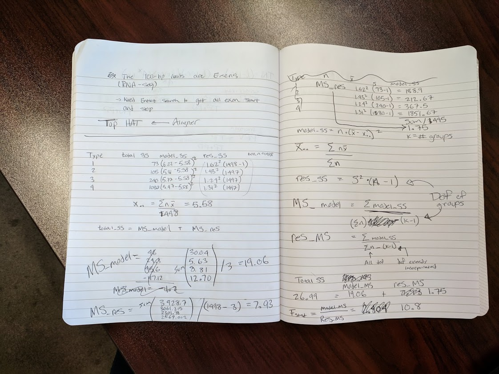

```{r setup, include=FALSE}
knitr::opts_chunk$set(echo = TRUE)
library(resampledata)
library(ggplot2)
library(tidyr)
library(dplyr)
library(multcomp)
```

#1
## ANOVA by hand

```{r}
#SMALL NUMBER FIRST, LARGE NUMBER SECOND
df(10.8, df1=3, df2=1497)
```
##a.
### Results
#### Total SS : 26.99 
#### Model MS : 19.06 
#### RES MS : 1.75
#### F-stat : 10.8 
#### P stat : 7.228e-07



##b. 
### Given an alpha = 0.05 , we still need to adjust the pvalue, we'll use bonferoni 
```{r}
p.adjust(7.22e-07, n=3, method='bonferroni')
```
#### Given the adjusted p, we can reject the null hypothesis with  confidence.  

##c. 
#### The Assumptions for a one-way anova: 
### 1. Response variable residuals are normally distributed (no underlying trends or sub-populations)
### 2. Responses are independant and indentically distributed random variables with normal distributions 
### 3. Equal Heteroskedacity : The population variation needs to be equal

##d. 
### The p-value was not explicitly required to be adjusted so that should be done to account for multiple comparisons. 
### Another great next step would be to write a program to calculate all this automatically, and then we'd never have to calculate by hand again! woohoo! 

##2.
####In the early 1900s, Latter (1902) investigated the behavior of female cuckoos, that lay their eggs on the ground and then move them to the nests of other birds. In particular, Latter gathered data on the lengths of the cuckoo eggs found in these foster-nests. Data based on this work is used in (Tippett, 1952) and is located in the file cuckoos. The data contains the lengths, in millimeters, of the lengths of cuckoo eggs and the species of the nests where the eggs were placed. Get the data by installing and loading the resampledata R package, and use the Cuckoos dataset.


```{r}
cuckoos <- Cuckoos
head(cuckoos)
## ID Eggs Bird
## 1 1 19.65 MeadowPipit
## 2 2 20.05 MeadowPipit
## 3 3 20.65 MeadowPipit
## 4 4 20.85 MeadowPipit
## 5 5 21.65 MeadowPipit
## 6 6 21.65 MeadowPipit
```

##a.
###Create side-by-side boxplots (in R) to compare the distribution of lengths across the different foster nests.

```{r}
cuckoos %>% ggplot(aes(x=Bird, y=Eggs, fill=Bird)) + geom_boxplot()
```

b. Conduct an ANOVA test (also in R) to see if the mean lengths of the cuckoo eggs are the same across
the different foster nests.
```{r}
birdlm <- lm(data=cuckoos, formula = 'Eggs ~ Bird')
bird.aov <- anova(birdlm)

bird.aov
```

##c. 
###Perform the Tukey Honestly Significant Difference test (without p-value adjustment) to compare all pairwise means. What can you conclude from this analysis?

This analysis shows that there 7 group comparisons that show significant differences from eachother. 
Wren-Robin               -1.44500000 -2.3770813 -0.51291874 0.0002402  
Wren-TreePipit           -2.04500000 -2.9770813 -1.11291874 0.0000001  
Wren-PiedWagtail         -1.77333333 -2.7203288 -0.82633783 0.0000048  
TreePipit-MeadowPipit     0.92500000  0.1678746  1.68212545 0.0074440  
Wren-MeadowPipit         -1.12000000 -1.8954121 -0.34458788 0.0007787  
Wren-HedgeSparrow        -1.99142857 -2.9551864 -1.02767078 0.0000004  
MeadowPipit-HedgeSparrow -0.87142857 -1.6672254 -0.07563177 0.0231538  

```{r}
aov <- aov(Eggs ~ Bird, cuckoos)
birdHSD <- TukeyHSD(aov, 'Bird', conf.level = 0.95)

birdHSD

```
##d. 
###Do the Tukey HSD test using the p-value adjustment method of your choice. Do your conclusions from "2c" change? Given the number of pairwise contrasts, without p-value adjustment, what would be your family-wise error rate if you were to conduct each pairwise contrast at /alpha = .05?
The numbers do change a bit, and if our alpha was smaller, it might change our interpretation. As is, with an alpha of 0.05, it does not change our interpretation. The error rate wouldn't change, since that's essentially what happened with the unadjusted p-values.   

MeadowPipit - HedgeSparrow == 0 -0.87143    0.27453  -3.174 0.028975 *    
Wren - HedgeSparrow == 0        -1.99143    0.33247  -5.990 3.75e-07 ***  
TreePipit - MeadowPipit == 0     0.92500    0.26119   3.542 0.008661 **   
Wren - MeadowPipit == 0         -1.12000    0.26750  -4.187 0.000839 ***  
Wren - Robin == 0               -1.44500    0.32154  -4.494 0.000253 ***  
Wren - TreePipit == 0           -2.04500    0.32154  -6.360 6.49e-08 ***  
Wren - PiedWagtail == 0         -1.77333    0.32669  -5.428 4.87e-06 ***  

```{r}

bird.ht <- glht(aov, linfct = mcp(Bird = "Tukey"))

summary(bird.ht, adjusted('bonferroni'))

```