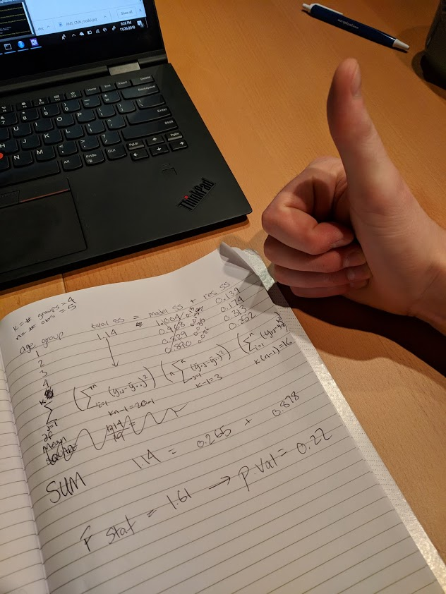

# ANOVA

```{r setup, include=FALSE}
knitr::opts_chunk$set(echo = TRUE)

library(tidyverse)
library(janitor)
library(moderndive)
library(broom)

```

# Get Data
```{r}

# create variable to store url
link <- "https://dataverse.harvard.edu/api/access/datafile/2712105"

# read in column names only
sticker_names <- link %>% 
  read_tsv(n_max = 0) %>% # default: col_names = TRUE
  rename(stickersgiven = 'absolutenumberofstickersgiven(Conditions1or3:Outof12;Conditions2or4:Outof30)') %>% 
  names()

# read in data, set column names
stickers <- link %>% 
  read_tsv(skip = 2, col_names = sticker_names) %>% 
  clean_names()

# clean it up a bit
# in class we got errors, so we commented out two lines
stickers_clean <- stickers %>% 
  mutate(num_stickers = case_when(
    number_stickers == 1 ~ 12,
    number_stickers == 2 ~ 30)) %>% 
  filter(!(subject_number == 263)) %>% 
  #mutate(condition = if_else(subject_number == 263, 3L, condition)) %>% 
  #mutate(num_stickers = if_else(subject_number == 263, 30L, num_stickers)) %>% 
  mutate(prop_given = round(stickersgiven / num_stickers, 2)) %>% 
  select(-percent_given_outof100percent, -number_stickers) %>% 
  mutate(giveornot = case_when(
    prop_given == 0 ~ 0,
    prop_given > 0 ~ 1)) 
```


# Simplify Data
```{r}
#y <- stickers_clean %>% select(prop_given)

set.seed(1990)
givers <- stickers_clean %>% 
  filter(giveornot == 1) %>% 
  mutate(age_groups = as.factor(agegroups))

mini_givers <- givers %>% 
  group_by(age_groups) %>% 
  sample_n(5) %>% 
  select(subject_number, prop_given, age_groups) %>% 
  ungroup()

#mini_givers %>% group_by(age_groups)
```

# Anova by hand
```{r}
tSS <- sum((mini_givers$prop_given - mean(mini_givers$prop_given))^2)

ANOVA <- mini_givers %>% group_by(age_groups) %>% summarize(grp_mean = mean(prop_given), total_SS = tSS, res_SS = sum( (prop_given - grp_mean)^2), model_SS = 5*sum((mean(prop_given) - mean(mini_givers$prop_given))^2))

ANOVA

ANOVA %>% summarize(total.SS = mean(tSS), model.SS = sum(model_SS), res.SS = sum(res_SS), MS.model = model.SS / 3, MS.res = res.SS / 16, F.stat = MS.model / MS.res, p.val = 1-pf(F.stat, df1=3, df2= 16))

#mini_givers %>% ggplot() + geom_density(aes(x=prop_given, group=age_groups, fill = age_groups, alpha = 0.25))
```

## proof and pudding


# lm for anova
```{r}
my_lm <- lm(data = mini_givers, formula = 'prop_given ~ age_groups')

summary(my_lm)
```

# Anova of lm
```{r}
anova(my_lm)
```

# aov
### weird error : Error: $ operator is invalid for atomic vectors
```{r}

#aov('prop_given ~ age_groups', mini_givers)

```


### This lab actually really helped. Two thumbs up. 